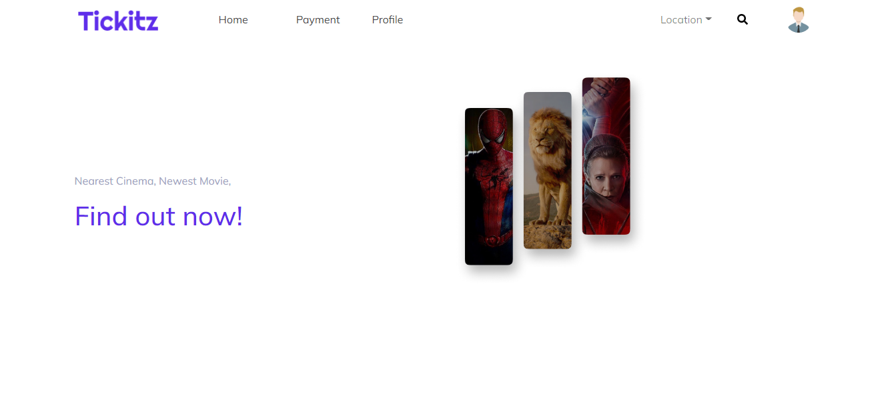
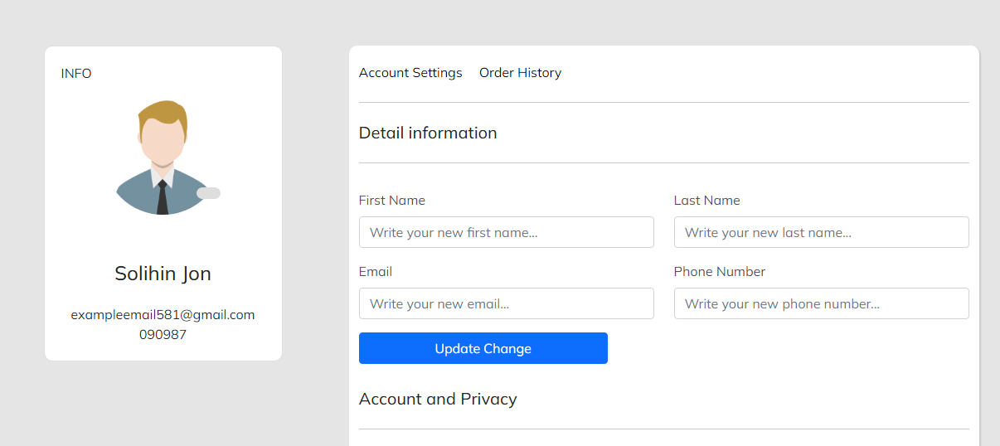
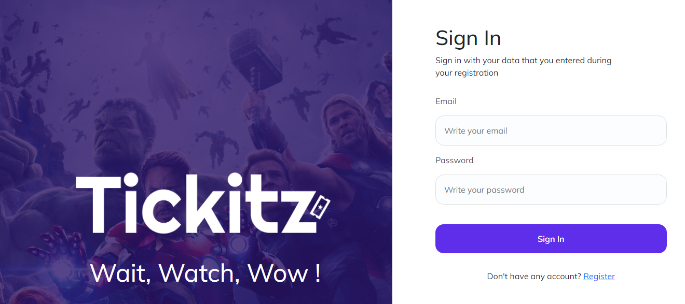
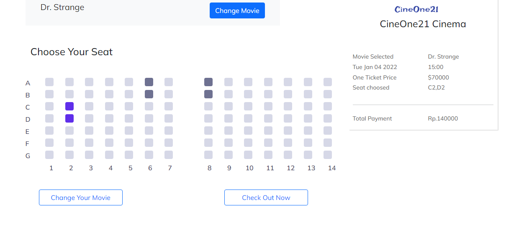
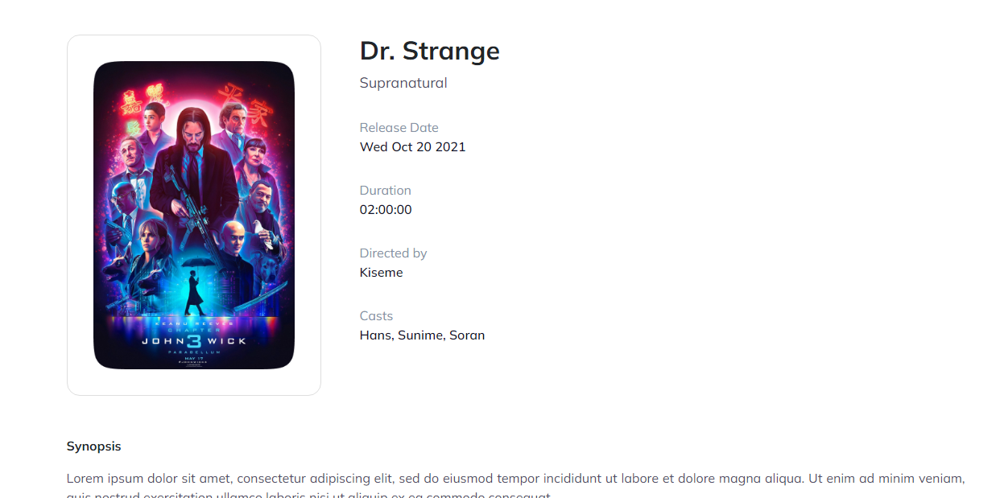

# TICKITZ MOVIE

Web Tickitz

<!-- NAVIGATION -->
<ol>
    <li>
      <a href="#about-the-project">About The Project</a>
      <ul>
        <li><a href="#built-with">Built With</a></li>
      </ul>
    </li>
    <li>
      <a href="#demo">Demo</a>
      <ul>
        <li><a href="#link">Link</a></li>
        <li><a href="#screenshot">soon</a></li>
      </ul>
    </li>
    <li>
      <a href="#getting-started">Getting Started</a>
      <ul>
        <li><a href="#prerequisites">Prerequisites</a></li>
        <li><a href="#installation">Installation</a></li>
      </ul>
    </li>
    <li><a href="#contact">Contact</a></li>
</ol>

<!-- ABOUT THE PROJECT -->

## About The Project

This application is a web-based online movie booking application for the Frontend / UI.

### Built With

some technology used in this project.

- [React](https://reactjs.org/)
- [Bootstrap](https://getbootstrap.com)
- [React paginate](https://www.npmjs.com/package/react-paginate)
- [Axios](https://www.npmjs.com/package/axios)
- [Redux](https://redux.js.org/)

<!-- DEMO -->

## Demo

### Link

Web : [https://tickitzmovie.netlify.app/]

### Screenshot

<div >
    
    
    
    
    
</div>

<!-- GETTING STARTED -->

## Getting Started

Get started with this project, intructions on setting up your project locally.
To get a local copy up and running follow these simple steps.

### Prerequisites

Before installing, you must be install [nodejs and npm.](https://nodejs.org)

### Installation

1. Clone this repo

```sh
git clone https: https://github.com/mrfachri19/Ticketing-React.git
```

2. Install NPM package

```sh
cd tickitz-app
npm install
```

3. Setting `.env`

- create `.env` file

```sh
touch .env
```

- Add configuration in `.env` file

```
REACT_APP_API=yourapi
```

4. Start the project

```sh
npm start
```

<!-- CONTACT -->

## Contact

repository: https://github.com/mrfachri19/Ticketing-React.git

API : https://github.com/mrfachri19/Ticket-API.git
